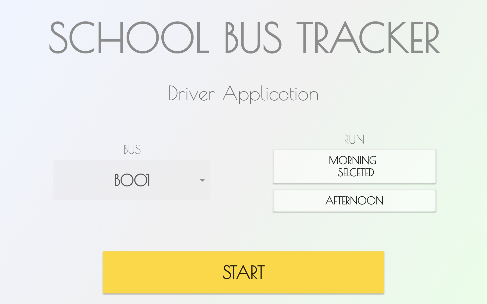
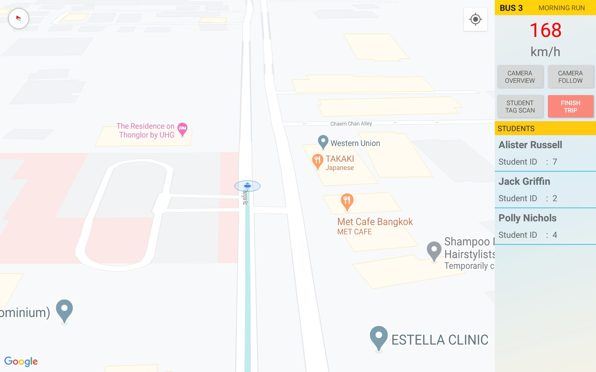
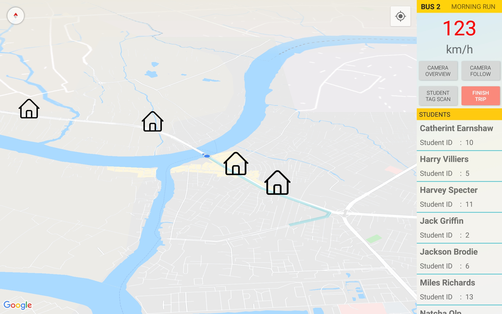
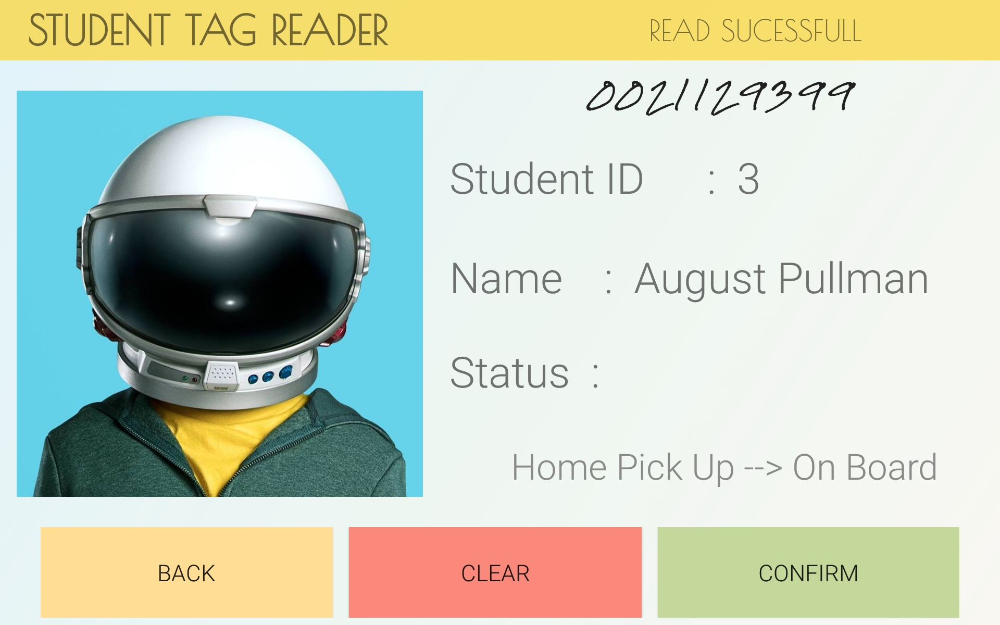
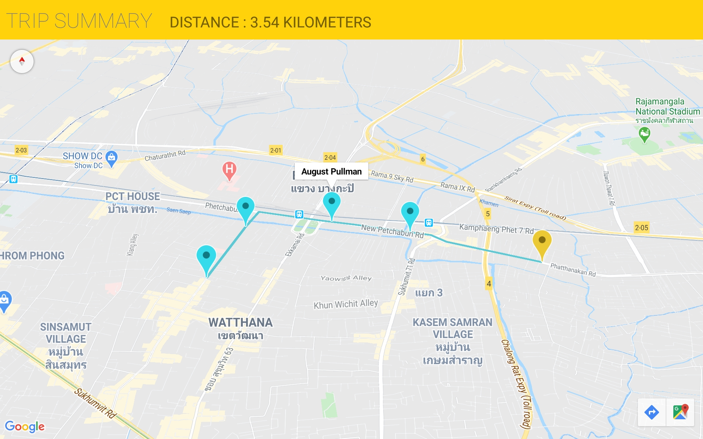
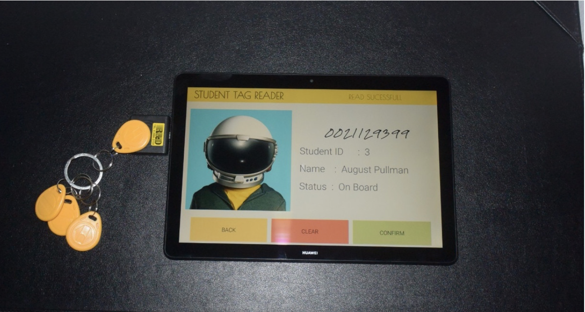

# Bus Driver Tracking Application
## Andriod Application

The dilemma of trusting your child to an unknown stranger is an extremely tough position to be in, throw in the treacherous roads of developing countries such as Thailand. Then trusting the life of your child to school bus seems like a critical decision. Our project aspired to resolve this issue through the utilisation of technology.

## Start Screen
This is the home screen, where the bus driver can select the bus number and the run which is either Morning or Afternoon. After choosing the driver can proceed to the main screen using the start screen.

## Driving Screen
shows the main screen, which displays the speed, list of the student to pick up or drop off and the map. The bus driver can also select the camera control system such as ”Camera overview” or ”Camera follow” while driving. The school bus driver will also be able to see the home icon for all the student in the list. The speed in red indicates that speed is over the limit.

## Tag Reading Screen
When click ”Student tag scan” will shows the tag reader system, which shows the image [if student has set an image] as well as details such as the student ID, Name, and status.

## Trip Summary
After select ”Finish trip” in Figure 6.7, Figure 6.9 will be show, it is the summary screen which would display the trip overview which includes the start point and the finish points as well as the location of student which has been picked up. Along with the total distance covered.

## Hardware Used
The process of our system is the same every day. When students get on the bus, they have to tap RFID tags with the reader on the bus. The reader is connected with the driver’s tablet. The application on the tablet will then update the student status to the Cloud Firestore. After that, the notification will be shown on the parent’s application.

## Colour Theme For Project

